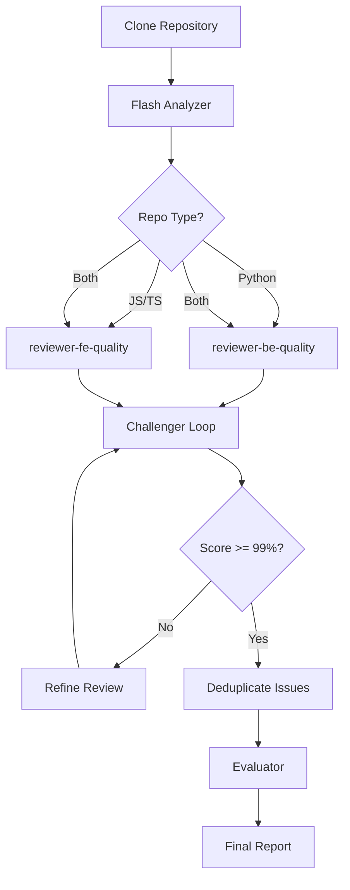
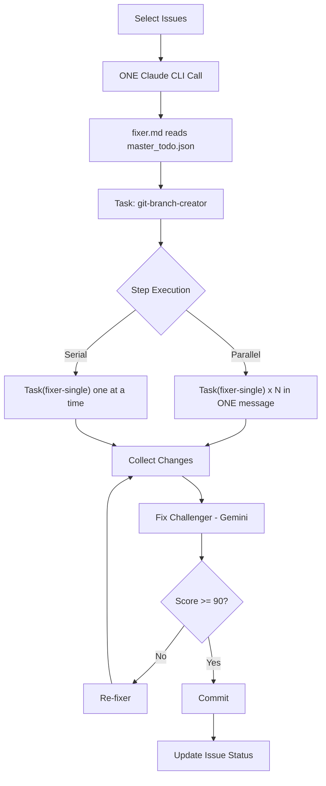

# TurboWrap Agent Registry

Central registry of all AI agents in the TurboWrap system.

## Quick Reference

| Agent | Model | Purpose | Tools |
|-------|-------|---------|-------|
| **orchestrator** | Opus | Master coordinator for code review | Read, Grep, Glob, Bash |
| **fixer** | Opus | Fix orchestrator - coordinates parallel/serial fixes | Read, Grep, Glob, Edit, Task |
| **fixer-single** | Opus | Fixes single issue (sub-agent) | Read, Grep, Glob, Edit |
| **fix-challenger** | Sonnet | Validates fixes, scores SOLVED/IN_PROGRESS | Read, Grep, Glob, Bash |
| **re-fixer** | Opus | Critically evaluates feedback, applies improvements | Read, Grep, Glob, Edit, Task |
| **reviewer-be-quality** | Opus | Backend code quality (linting, security, types) | Read, Grep, Glob, Bash |
| **reviewer-be-architecture** | Opus | Backend architecture (SOLID, layers) | Read, Grep, Glob, Bash |
| **reviewer-fe-quality** | Opus | Frontend quality (ESLint, TypeScript) | Read, Grep, Glob, Bash |
| **reviewer-fe-architecture** | Opus | Frontend architecture (components, hooks) | Read, Grep, Glob, Bash |
| **reviewer-dedup-be** | Opus | Backend code duplication detection | Read, Grep, Glob, Bash |
| **reviewer-dedup-fe** | Opus | Frontend code duplication detection | Read, Grep, Glob, Bash |
| **analyst-func** | Opus 4.5 | Functional analysis (business logic, edge cases) | Read, Grep, Glob, Bash |
| **evaluator** | Opus | Repository quality scorer (6 dimensions) | Read, Grep, Glob |
| **flash-analyzer** | Haiku | Fast repo structure analysis | Read, Grep, Glob, Bash |
| **git-branch-creator** | Haiku | Creates fix branches | Read, Grep, Glob, Bash |
| **git-committer** | Haiku | Commits specific files | Read, Grep, Glob, Bash |
| **git-merger** | Haiku | Merges branches to main | Read, Grep, Glob, Bash |
| **lint-fixer** | Sonnet | Auto-fixes linting issues | Read, Grep, Glob, Bash |
| **test-analyzer** | Opus | Analyzes test coverage and quality | Read, Grep, Glob |
| **test-creator** | Opus | Creates TurboWrapTest files | Read, Grep, Glob, Write, Bash |
| **test-discoverer** | Haiku | Discovers test frameworks | Read, Grep, Glob, Bash |
| **readme-analyzer** | Opus | Generates README analysis with Mermaid | Read, Grep, Glob |
| **linear-issue-analyzer** | Opus | Analyzes Linear issues | Read, Grep, Glob, Bash |
| **linear-question-generator** | Opus | Generates clarification questions | Read, Grep, Glob, Bash |
| **linear-finalizer** | Opus | Finalizes Linear issues | Read, Grep, Glob, Bash |

---

## Agent Categories

### Review Agents

Code review specialists that analyze different aspects:

| Agent | Focus | Runs Linters |
|-------|-------|--------------|
| reviewer-be-quality | Ruff, Bandit, mypy, type safety | Yes |
| reviewer-be-architecture | SOLID, layer separation, patterns | No |
| reviewer-fe-quality | ESLint, TypeScript, Web Vitals | Yes |
| reviewer-fe-architecture | Component structure, hooks, state | No |
| reviewer-dedup-be | Code duplication in Python | No |
| reviewer-dedup-fe | Code duplication in React/TS | No |
| analyst-func | Business logic, edge cases | No |

### Fix Agents

Autonomous code fixing pipeline using **ONE CLI call with Task tool**:

```
POST /fix/start
       │
       ▼
   ONE Claude CLI Call
       │
       ▼
   ┌─────────────────────────────────────────────┐
   │              fixer.md (Orchestrator)         │
   │                                              │
   │  Reads: master_todo.json                     │
   │                                              │
   │  Task(git-branch-creator) → Create branch   │
   │                                              │
   │  Step 1: PARALLEL (ONE message)             │
   │  ┌─────────────┐  ┌─────────────┐           │
   │  │ Task(fixer- │  │ Task(fixer- │ ← Same msg│
   │  │ single) #1  │  │ single) #2  │           │
   │  └─────────────┘  └─────────────┘           │
   │                                              │
   │  Step 2: SERIAL (separate messages)          │
   │  ┌─────────────┐                             │
   │  │ Task(fixer- │ ← Different msg            │
   │  │ single) #3  │                             │
   │  └─────────────┘                             │
   └─────────────────────────────────────────────┘
       │
       ▼
   ┌─────────────┐
   │fix-challenger│ ─── Gemini validates per-issue
   └──────┬──────┘
          │ if score < 90
          ▼
   ┌─────────────┐
   │  re-fixer   │ ─── Evaluates feedback
   └──────┬──────┘
          │
          ▼
   ┌─────────────┐
   │git-committer│ ─── Commits changes
   └─────────────┘
```

**Key**: ONE CLI call → fixer.md uses Task tool internally for parallelism

### Git Agents (Cost-Optimized)

Use Haiku for simple git operations:

- **git-branch-creator**: Creates `fix/auto-YYYYMMDD-HHMMSS` branches
- **git-committer**: Stages and commits specific files (never `--add-all`)
- **git-merger**: Merges branches, handles conflicts

---

## Cost Matrix (Claude API)

| Model | Input $/1M | Output $/1M | Use Case |
|-------|------------|-------------|----------|
| Opus 4.5 | $15 | $75 | Complex reasoning, code review |
| Sonnet | $3 | $15 | Validation, challenger |
| Haiku | $0.25 | $1.25 | Git ops, simple tasks |

### Cost Optimization Strategies

1. **Session Caching**: Reuse Claude CLI sessions across batches (~33% savings)
2. **Haiku for Git**: Use cheapest model for git operations
3. **Parallel Execution**: Run BE + FE fixes simultaneously
4. **Context Compaction**: Trigger `/compact` when context > 150k tokens

---

## Agent Details

### fixer

**File:** [agents/fixer.md](agents/fixer.md)

**Trigger:** POST /fix/start

**Input:**
- TODO list JSON with branch name and issue groups
- Issues classified as parallel (different files) or serial (same file)

**Output:**
```json
{
  "branch_name": "fix/auto-20251229-183500",
  "issues_fixed": 5,
  "issues_failed": 1,
  "results": [...]
}
```

**Dependencies:** fixer-single, git-branch-creator

---

### fix-challenger

**File:** [agents/fix_challenger.md](agents/fix_challenger.md)

**Role:** Senior developer reviewing fixes before commit

**Scoring Criteria (Weighted):**
- Correctness (40%): Does fix solve the issue?
- Safety (30%): No new bugs/vulnerabilities?
- Minimality (15%): Only necessary changes?
- Style (15%): Matches codebase patterns?

**Status Mapping:**
- Score >= 90: `SOLVED`
- Score < 90: `IN_PROGRESS`

**Red Flags (Auto Score 0):**
- Empty diff
- Wrong file modified
- Claimed fix not in diff
- Dead code added

---

### re-fixer

**File:** [agents/re_fixer.md](agents/re_fixer.md)

**Role:** Critically evaluates challenger feedback

**Decision Logic:**
- `KEEP`: Issue already SOLVED (score >= 90)
- `AGREE`: Challenger found valid problem → apply fix
- `PARTIALLY_AGREE`: Some points valid → apply selectively
- `DISAGREE`: Feedback wrong/out-of-scope → keep original

**Valid Disagreement Examples:**
- Stylistic preferences (const vs let when reassigned)
- JSDoc requirements for bug fixes
- Over-engineering suggestions
- Out-of-scope changes

---

### orchestrator

**File:** [agents/orchestrator.md](agents/orchestrator.md)

**Role:** Master coordinator for code review

**Detection Flow:**
```
1. DETECT REPO TYPE
   ├── Python → Backend reviewers
   ├── JS/TS → Frontend reviewers
   └── Both → Full-stack (all reviewers)

2. LAUNCH analyst_func (always)

3. CHALLENGER LOOP
   Reviewer → Challenger → Score < 99% → Refine → Repeat
   └── Until >= 99% or max 5 iterations

4. COLLECT & DEDUPLICATE ISSUES
```

**Thresholds:**
- Satisfaction: 99%
- Max iterations: 5 (hard cap: 10)
- Forced acceptance: 90% after max iterations

---

## Workflow Diagrams

### Code Review Flow



### Fix Flow



---

## Adding New Agents

1. Create `agents/<agent-name>.md` with YAML frontmatter:
   ```yaml
   ---
   name: my-agent
   description: What this agent does
   tools: Read, Grep, Glob, Edit
   model: opus
   ---
   ```

2. Add to this registry (AGENTS.md)

3. Register in CLI config if needed

4. Add to orchestrator if part of review/fix flow

---

## Related Files

- [README.md](README.md) - Project overview
- [CLAUDE.md](CLAUDE.md) - Context for Claude Code
- [GEMINI.md](GEMINI.md) - Context for Gemini Challenger
- [agents/engineering_principles.md](agents/engineering_principles.md) - Code philosophy
